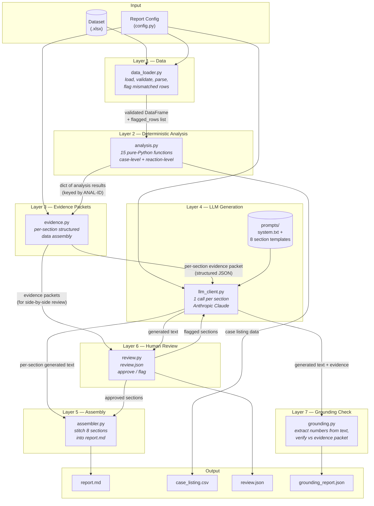

# GenAR PADER Report Generator (Version 0)

This system ingests a pharmacovigilance adverse-event dataset (ICSR/FAERS-style) and produces a structured, evidence-grounded PADER-style safety report.

## 1. How to Run

**Prerequisites:** Python 3.10+, an Anthropic API key.

1. **Install dependencies:**
   ```bash
   pip install -r requirements.txt
   ```

2. **Configure environment:**
   Copy `.env.example` to `.env` and add your Anthropic API key:
   ```
   ANTHROPIC_API_KEY=your_key_here
   ANTHROPIC_MODEL=claude-sonnet-5
   ```

3. **Run the pipeline (standard mode):**
   ```bash
   python main.py --dataset path/to/dataset.xlsx
   ```
   The pipeline will pause after generating sections and output `review.json`. A human edits `status` to `"approved"` or `"flagged"`, then resumes the pipeline:
   ```bash
   python main.py --resume-review
   ```

4. **Run without pausing (auto-approve):**
   ```bash
   python main.py --dataset path/to/dataset.xlsx --auto-approve
   ```

5. **Run without LLM (template fallback):**
   *(Useful for testing without API costs)*
   ```bash
   python main.py --dataset path/to/dataset.xlsx --no-llm --auto-approve
   ```

Outputs will be placed in the `output/` directory:
- `report.md`: The final assembled report.
- `case_listing.csv`: The full 1,024-case index.
- `review.json`: The human review state.
- `evidence_packets.json`: The raw data packets sent to the LLM.
- `grounding_report.json`: The automated grounding check results.

---

## 2. Architecture

The system uses a strict 7-layer pipeline. It deliberately avoids multi-agent orchestration or RAG, as the problem is entirely bounded by structured data ingestion and targeted prose generation.



---

## 3. AI vs. Deterministic Split (and Rationale)

**Deterministic (Layers 1-3):** All data loading, cleaning (age unit conversion, null handling), and counting/grouping. 
**AI (Layer 4):** Text generation *only*. The LLM never computes a percentage or counts a case.

**Rationale:** LLMs are notoriously unreliable at arithmetic and large-scale data aggregation. By strictly decoupling computation from generation, we guarantee mathematical accuracy. The LLM only receives a pre-computed "evidence packet" (a JSON dict) for the specific section it is writing, drastically reducing context window size, hallucination risk, and prompt complexity.

---

## 4. Prompts

All prompts are stored as plaintext files in the `prompts/` directory.

### System Prompt (Shared)
```text
You are a regulatory medical writer producing a section of a Periodic Adverse Drug Experience Report (PADER) for submission to the FDA under 21 CFR 314.80.

RULES — these are absolute and override any other instruction:
1. Only state numbers, counts, percentages, and facts that appear explicitly in the EVIDENCE PACKET provided below. Do not perform arithmetic. Do not estimate. Do not round differently than the packet provides.
2. Distinguish clearly between:
   - OBSERVED DATA: direct counts from the dataset (e.g., "1,023 cases were classified as serious")
   - DERIVED ANALYSIS: rankings or comparisons computed from the data (e.g., "Acute kidney injury was the most frequently reported reaction")
   - INTERPRETATION: any inference beyond the data (e.g., "this may warrant further review") — use sparingly and always qualify with "may" or "warrants further evaluation"
3. Never state a safety conclusion (e.g., "no safety concerns were identified") unless the evidence packet explicitly contains that conclusion.
4. Use a regulatory, neutral, professional tone throughout.
5. Write in third person. Use past tense for the reporting period.
6. Format output as Markdown. Do not include the section heading — it will be added by the assembler.
7. If the evidence packet contains data_notes about limitations (e.g., SOC-level analysis unavailable, expectedness out of scope), incorporate those limitations naturally into the text where relevant rather than ignoring them.
```

### Example Section Prompt (`section_narrative_summary.txt`)
```text
Write the "Narrative Summary and Analysis" section of the PADER.

This section provides an overall understanding of the safety information received during the reporting period. It should cover:
- Total case count and serious/non-serious breakdown
- Most commonly reported reactions (overall and serious)
- Outcome distribution summary
- Monthly reporting trends (note any increases or decreases as observations, not conclusions)
- Any notable observations supported by the data

Remember: distinguish between observed data, derived analysis, and interpretation. Present observations and let the reader draw conclusions.

EVIDENCE PACKET:
{evidence_packet}
```

*(The `{evidence_packet}` is dynamically replaced with the JSON payload for that section).*

---

## 5. Grounding Mechanism

The system includes an automated **Grounding Checker** (`grounding.py`):
1. It extracts every number (integers, floats, percentages, comma-formatted) from the LLM's generated text.
2. It extracts every numeric value from the section's source Evidence Packet (including numbers embedded in strings, like date components).
3. It performs a set subtraction: `text_numbers - packet_numbers`.
4. If any number remains, it is ungrounded (a hallucination or an LLM-computed arithmetic error), and the section fails the check.

This proves that the LLM is not inventing data.

---

## 6. Evaluation at Scale (1,000 Reports)

If this system were deployed to generate 1,000 reports across different datasets:
1. **Automated Metrics**: We would run the Grounding Checker across all 1,000 reports and track the **Grounding Pass Rate** (percentage of sections with zero ungrounded numbers). We would also track the hallucination frequency by section type to identify which prompts need refinement.
2. **Review Metrics**: By tracking the human `status` updates in `review.json`, we can measure the **Human Approval Rate** on first pass, as well as analyze human-added comments to identify systematic tone or formatting issues.
3. **Pipeline Stability**: Track standard data pipeline metrics (schema validation failure rate, reaction/outcome mismatch flagging rate) to measure data quality upstream.

---

## 7. Known Limitations (Version 0)

- **SOC-level reaction grouping**: Unavailable. The dataset provides reactions at the MedDRA Preferred Term (PT) level only.
- **Expectedness**: Out of scope. No product label / CCDS was supplied, so labelled/unlabelled assessment could not be performed.
- **History of actions**: Unavailable (no data supplied).
- **Embedded-comma PTs**: Approximately 6 of 1,068 rows (0.6%) were excluded from reaction-level exploded analyses because their MedDRA PTs contained internal commas (e.g., "Hallucination, visual"), which breaks positional splitting against the outcome field. These rows are fully included in all case-level analyses.
- **Interactive Review CLI**: The human review gate is currently implemented as a batch-mode JSON file (`review.json`). An interactive CLI mode is out of scope for V0 but would be added in a production version.
- **Multiple Report Types**: The architecture supports adding PSUR/DSUR via configuration (`config.py`), but only PADER is implemented in V0.
- **Grounding Checker Specificity**: The `check_grounding()` function currently validates that a number in the generated text exists *anywhere* in the evidence packet (via set membership). A hallucinated number that coincidentally matches an unrelated value (e.g., a case ID matching a percentage) will incorrectly pass, and non-numeric hallucinations are not caught. A V1 fix would require the LLM to cite the specific JSON key for each number it uses (e.g., `[ANAL-02.serious_pct]`), allowing the checker to verify the exact value mapping rather than packet-wide membership.
